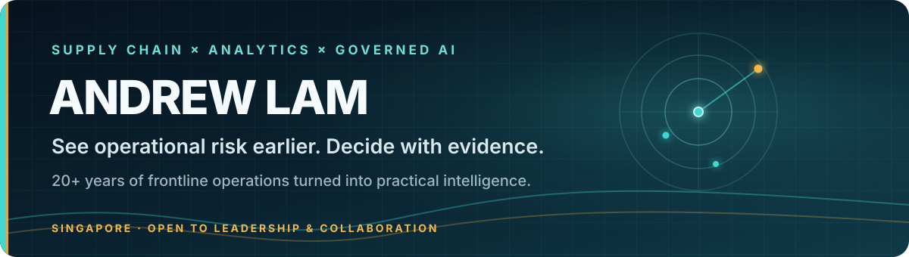

  

## I turn complex operations into decisions that move.

I combine **20+ years in supply chain, warehousing, cold chain, container operations and frontline execution** with analytics and applied AI. The work here is built to surface risk earlier, make decisions more accountable and keep every claim tied to evidence.

> **My operating question:** Can we see deterioration before the KPI turns red?

[**Inspect the evidence →**](https://authority-engine-app.vercel.app/) · [**Explore the work →**](https://authority-engine-app.vercel.app/insights) · [**Start a conversation →**](https://authority-engine-app.vercel.app/contact)

**Open to:** operations excellence leadership · operational analytics · serious collaborations in governed AI and early-warning systems

---

## Proof before promise

| **20+ years** | **391 jobs** | **S$75,720** | **1,800 scenarios** |
|---|---|---|---|
| Real operating experience | Anonymised container-operation records | Recorded revenue across 7 reporting periods | AI-assisted synthetic cold-chain risk records |

Real operating evidence, controlled demonstrations and experimental products are labelled separately. **A prototype is not proof, and a model is not reality.**

## Choose your route

| If you want to… | Start here |
|---|---|
| Assess my operating depth and analytical capability | [**Open Authority Engine**](https://authority-engine-app.vercel.app/) |
| Inspect the code, decisions and evidence boundaries | [**Explore the repositories**](https://github.com/AndrewLamSingapore?tab=repositories) |
| Discuss an operations problem, role or collaboration | [**Start a conversation**](https://authority-engine-app.vercel.app/contact) |

## Selected systems

| System | What it demonstrates | Explore |
|---|---|---|
| **Authority Engine** | An evidence-led portfolio connecting real operating experience with inspectable analytics and applied AI | [Live](https://authority-engine-app.vercel.app/) · [Code](https://github.com/AndrewLamSingapore/authority-engine) |
| **VELYQUA 维澜** | A governed freshwater digital-twin and sensor-fusion experiment for earlier aquarium-risk detection | [Live](https://velyqua.vercel.app/) · [Code](https://github.com/AndrewLamSingapore/velyqua) |
| **The Portal** | An AI-assisted knowledge system that turns encounters into connections, questions and testable experiments | [Live](https://the-portal-ten.vercel.app/) · [Code](https://github.com/AndrewLamSingapore/the-portal) |
| **Game Platform** | A persistent AI-native world with governed reasoning and server-authoritative state | [Experience](https://game-platform-wine-nine.vercel.app/) |

## The operating method

**OBSERVE → CONNECT → ANTICIPATE → DECIDE → ACT → LEARN**

Individual signals can be weak, late or misleading. Their relationships can reveal something useful earlier. That thesis connects my work across physical operations, analytics, edge sensing, knowledge systems and experimental products.

**Operations** — supply chain · warehousing · cold chain · container planning · inventory · manpower · process improvement 
**Analytics** — KPI design · management reporting · Power BI · SQL · analytical modelling · root-cause analysis 
**Intelligence systems** — weak-signal detection · edge sensing · knowledge graphs · governed AI · product prototyping · decision support

## Let’s compare notes

If you are working on **operational decision support, supply-chain early warning, operations excellence or governed AI**, bring the real problem. I value useful exchanges, evidence-led collaboration and relationships that compound over time.

[**Start with the evidence**](https://authority-engine-app.vercel.app/) · [**Send a direct inquiry**](https://authority-engine-app.vercel.app/contact) · [**Connect on LinkedIn**](https://www.linkedin.com/in/lam-teck-sing-andrew-79886719)

Singapore · Operations expertise first; technology as leverage.

<!-- Public profile conversion baseline: 2026-08-31. -->
